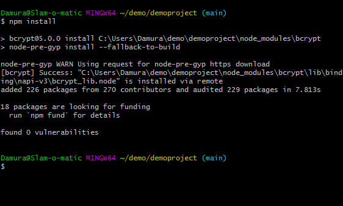

# DemoProject <!-- omit in toc -->

# Table of Contents <!-- omit in toc -->

- [1. Introduction](#1-introduction)
  - [1.1. Functionality and features](#11-functionality-and-features)
    - [1.1.1. Basic functions:](#111-basic-functions)
    - [1.1.2. Current features:](#112-current-features)
    - [1.1.3. Currently under development:](#113-currently-under-development)
  - [1.2. Tech](#12-tech)
- [2. Running a local repository](#2-running-a-local-repository)
  - [2.1. Prerequisites](#21-prerequisites)
- [3. Installation tutorial](#3-installation-tutorial)
  - [3.1. Preparing the repository](#31-preparing-the-repository)
    - [3.1.1. Clone the repository](#311-clone-the-repository)
    - [3.1.2. Install dependencies](#312-install-dependencies)
  - [3.2. Setting up MySQL](#32-setting-up-mysql)
    - [3.2.1. XAMPP control panel](#321-xampp-control-panel)
    - [3.2.2. MySQL config](#322-mysql-config)
    - [3.2.3. Start MySQL](#323-start-mysql)
      - [3.2.3.1. Testing connection with MySQL Workbench](#3231-testing-connection-with-mysql-workbench)
        - [3.2.3.1.1. Manually add connection with MySQL workbench](#32311-manually-add-connection-with-mysql-workbench)
      - [3.2.3.2. Testing connection with apache](#3232-testing-connection-with-apache)
    - [3.2.4. Creating a new schema](#324-creating-a-new-schema)
      - [3.2.4.1. With MySQL Workbench](#3241-with-mysql-workbench)
  - [3.3. Starting the web application](#33-starting-the-web-application)
    - [3.3.1. Configuration](#331-configuration)
    - [3.3.2. First startup](#332-first-startup)
    - [3.3.3. Basic functions to start off](#333-basic-functions-to-start-off)
- [4. Related queries](#4-related-queries)
  - [4.1. Accounts](#41-accounts)
    - [4.1.1. Account updating examples](#411-account-updating-examples)
    - [4.1.2. Account deletion examples](#412-account-deletion-examples)

# 1. Introduction

This is a demo project made as a part of the Code Bootcamp 2020 training program. The main function is a work clocking system web application. This project is a work in progress and the main usage is currently extremely limited.

## 1.1. Functionality and features

A list of the basic functionality and features of this project:

### 1.1.1. Basic functions:

- Login system
- Register system
- User validation requirement through admin

### 1.1.2. Current features:

- Password encryption
- Single session login

### 1.1.3. Currently under development:

- Admin and group lead specific app pages for user management
- A fully functional time clocking system

## 1.2. Tech

This demo project uses the following open source projects:

- [node.js] - Asynchronous event-driven JavaScript backend
- [body-parser] - Node.js body parsing middleware
- [bcrypt] - A Node.js library for password hashing
- [Express] - A Node.js web application framework
- [Express-session] - Session middleware to be used with express
- [jQuery] - A highly used feature-rich Javascript library
- [Bootstrap] - A front end web framework for building responsive sites
- [mysqljs] - A Node.js driver for MySQL
- [mysql-session] - A MySQL session store for Express

# 2. Running a local repository

## 2.1. Prerequisites

- [node.js] Required for running the application
- Any local MySQL server, tutorial will use [xampp]
- A text editor of your choice, tutorial will use [vscode]
- _optional_ A database viewer, like [mysql-workbench]
- *optional* [git] installed for cloning the repo, you can also download the main branch from the github page but the tutorial will follow with terminal instructions

# 3. Installation tutorial

**Install prerequisites before continuing**

## 3.1. Preparing the repository

In this step we will prepare the local repository, if you are familiar with git you can skip to [3.1.2. Install dependencies](#312-install-dependencies)

### 3.1.1. Clone the repository


Make a new folder with any name, this tutorial will use demo with the command: <br> 
`mkdir demo` <br> 
and then open that folder with: <br>
`cd demo/`


Then clone the repository with the following command.: <br>
`git clone https://github.com/esaleino/demoproject.git` <br>
And then change directory to the repository root folder with: <br>`cd demoproject/`

If you don't have git, download the main branch from github and extract to the folder.

### 3.1.2. Install dependencies



While in the project root folder, run <br> `npm install`<br>
All the dependencies should now be installed but before the application can be run, we still need a database running and some configuration.<br><br>
**DON'T CLOSE THE TERMINAL YET, WE WILL NEED IT LATER**

## 3.2. Setting up MySQL

Next we will start the MySQL server and make sure we can connect to it, if you already have a server running you can skip to [3.2.4. Creating a new schema](#324-creating-a-new-schema)

### 3.2.1. XAMPP control panel


Launch XAMPP control panel and you should see the following window if you are running on a windows operating system. The marked line is for MySQL server options.

### 3.2.2. MySQL config


You can go ahead and configure your MySQL server and for example set the password or port if you want to, but the server will work fine for a local environment without configurations.

### 3.2.3. Start MySQL


Click on the marked start button to start your MySQL server, you can also start the apache app for testing connection to the database.

#### 3.2.3.1. Testing connection with MySQL Workbench


MySQL Workbench should automatically find your running MySQL server and you can connect to it by clicking the on the local instance. If MySQL Workbench gives you a warning about database versions, click on `Continue Anyway` to continue. If you were successful, you should have a new tab open for your connection, if not go try manual connection. 

##### 3.2.3.1.1. Manually add connection with MySQL workbench

If you were successful in the previous step, you can skip to [3.2.4.1. With MySQL Workbench](#3241-with-mysql-workbench)

If MySQL Workbench didn't find the connection automatically, select `database -> manage connections` from the top menu. The following should appear: 


From the bottom left, click new to make a new connection and then configure the following options on the right panel:<br>
`Connection name`: Enter a name for your connection, we have it set as `new connection` <br>
`Hostname`: Enter either `localhost` or `127.0.0.1` <br>
`Port`: If you have changed this in configuration change it to whatever you set it to, otherwise 3306 for default <br>
`Username`: Set this to `root` or whatever your configuration is set to <br>
`Password`: By default there is no password, but if you have set one then enter that password<br>
Now click on the `Test Connection` button at the bottom right, if you get a warning in this step just click `Continue anyways`. You should now have a successful connection set up and you can close this window. <br>
<br>
You should see the following in the main panel now: 


Now you can click the new connection and it should open in a new tab and you're done, your MySQL server is now running and we have tested the connection successfully!

#### 3.2.3.2. Testing connection with apache

WIP

### 3.2.4. Creating a new schema

In this step we will create a new schema for our web application to use for its data storage. 
#### 3.2.4.1. With MySQL Workbench

After successfully connecting to the database, you will see a `Navigator` section on the left side. 


If yours looks like above, then you will have to click the `Schemas` on the bottom right to enter the `Schemas` view. 


Now in the schemas, right click and click the `Create schema`. Next our create schema tab should appear on the right:


Modify the name of the new schema to what you would like to call it, we will be calling it `demoproject`, click on `apply` in the bottom right and `apply - finish` on the prompts followed by it.

And that's it! We now have a schema added to our database to use as our web applications data storage. You can access the new schema from the navigator section and familiarize yourself with the MySQL workbench and continue to [3.3.1. Configuration](#331-configuration) when ready.

## 3.3. Starting the web application

Now that our MySQL server is running and tested, and we have a schema made, we can continue on to the actual web application!

### 3.3.1. Configuration

First, we will be going to the root directory of our repository, in the root directory you will find a file called `config.sample.js`, remove the .sample part of this filename so it will be as follows: `config.js`. Open the configuration file in your text editor and you will see the following configurations: 


A brief explanation on the configurations: <br>
`config.telegramAuthToken` <br>
This is for telegrambot integration, which is currently not functional. You can leave it as is, for its currently not setup to run with the application. <br>
`config.connectionLimit`<br>
Set the maximum connections allowed, you can leave this on default<br>
`config.connectionHost`<br>
This is the hostname for your MySQL server, set as either localhost or 127.0.0.1 if you are running a local server. If you are using a remote server then use the parameters from that instead.<br>
`config.connectionUser`<br>
Username for the database, default user is `root` if you didn't make a new user.<br>
`config.connectionPassword`<br>
Password for the database, default is blank unless you changed it.<br>
`config.connectionDatabase`<br>
The name for our database schema, you can use whatever you set in the previous step here and as such we will use the `demoproject` schema we made before<br>
`config.connectionPort`<br>
The port your MySQL server is running on, leave on default `3306` unless you changed it.<br>
`config.runBuilder`<br>
This will run a preset builder to populate our schema with preset tables and populate them with template data. Leave on true for first startup.

### 3.3.2. First startup 

Now we will have to go back to the terminal and change to our root directory and run the following command `npm start`: 


You can also use `DEBUG=express* npm start` for additional logging information. The console should output results for building our template tables and you should see a `connected as id *` if you scroll to above. If you run into any errors make sure you have configured everything correctly and that your schema names match in configuration and in the database.<br>
If you had no errors, you can now go to `127.0.0.1:3000` in the browser and the home page should load, if it does you're done! The web application is running successfully and we can now use it through the browser! If the web page doesn't load check the terminal logs if there are any errors and make sure that your configurations are set properly.

### 3.3.3. Basic functions to start off

You can register a new account at `127.0.0.1:3000/register`

**IMPORTANT: CURRENTLY THERE IS NO TEMPLATE FOR USERS, MAKE AN ADMIN ACCOUNT FIRST WITH THE ACCOUNT NAME `admin` TO ACCESS THE ADMIN PANEL!!**

After registering successfully, the web app will redirect you to the login page. If you go in to the database viewer you can see all the template tables that were made, the user account information is saved in both the `accounts` table that has the username, hashed password, email, and a state for validation, and the `persons` table that holds additional information about the user. Currently there is no way to change user information inside the web app and it has to be done manually with a query to activate the account, admin account can login without being validated. <br>*check [4.1.1. Account updating examples](#411-account-updating-examples) for additional information*

# 4. Related queries

Here are some project related queries you can use in MySQL Workbench by opening a new query from `File - New Query Tab`

## 4.1. Accounts

Account related queries

### 4.1.1. Account updating examples 


**IMPORTANT: DON'T CHANGE PASSWORDS OR CREATE NEW ACCOUNTS THROUGH WORKBENCH - MAKE THE ACCOUNTS THROUGH THE WEB APP ITSELF AS IT USES `bcrypt` FOR PASSWORD HASHING SO PLAIN TEXT PASSWORDS WILL NOT WORK!!**

<br> Shows all unvalidated accounts in the database:

```SQL
SELECT * FROM accounts 
WHERE validated = 0;
```
<br>Query that validates accounts by username, Replace `'username'` with the account you wish to validate:

```SQL
UPDATE accounts 
SET validated = '1' 
WHERE username = 'username';
```
 <br>... Or to validate all existing accounts use: 

```SQL
UPDATE accounts 
SET validated = '1';
```
**THIS DOES NOT WORK WITH MYSQL WORKBENCH SAFE MODE ENABLED - TO DISABLE SAFE MODE GO TO `Edit - preferences - SQL editor` AND UNTICK SAFE MODE AT THE BOTTOM AND RECONNECT TO THE DATABASE WITHOUT CLOSING THE APPLICATION** <br> <br>
Alternatively without disabling safe mode, you may use: <br>

```SQL
UPDATE accounts 
SET validated = '1' 
WHERE username != null;
```
This will update all accounts in the table to be validated. <br>

### 4.1.2. Account deletion examples

First, select accounts from the table with: <br>
```SQL
SELECT * 
FROM accounts 
```
<br>
This will show all the accounts in the database. Next, to delete you simply run: <br>

```SQL
DELETE accounts, persons 
FROM accounts 
INNER JOIN persons 
ON persons.username = accounts.username
WHERE accounts.username = 'test';
```
Note that this will also remove the account related information from the persons table.


[node.js]: http://nodejs.org
[express]: http://expressjs.com
[jquery]: http://jquery.com
[bootstrap]: https://github.com/twbs/bootstrap
[body-parser]: https://github.com/expressjs/body-parser
[bcrypt]: https://github.com/kelektiv/node.bcrypt.js
[express-session]: https://github.com/expressjs/session
[mysqljs]: https://github.com/mysqljs/mysql
[mysql-session]: https://github.com/chill117/express-mysql-session
[xampp]: https://www.apachefriends.org/index.html
[mysql-workbench]: https://dev.mysql.com/downloads/workbench/
[vscode]: https://code.visualstudio.com/
